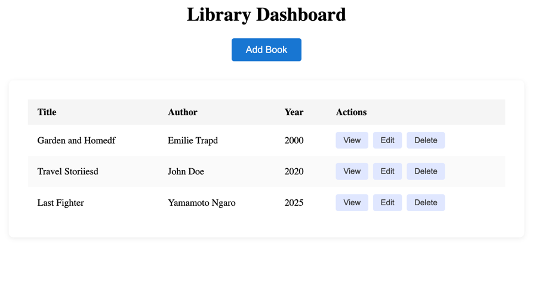
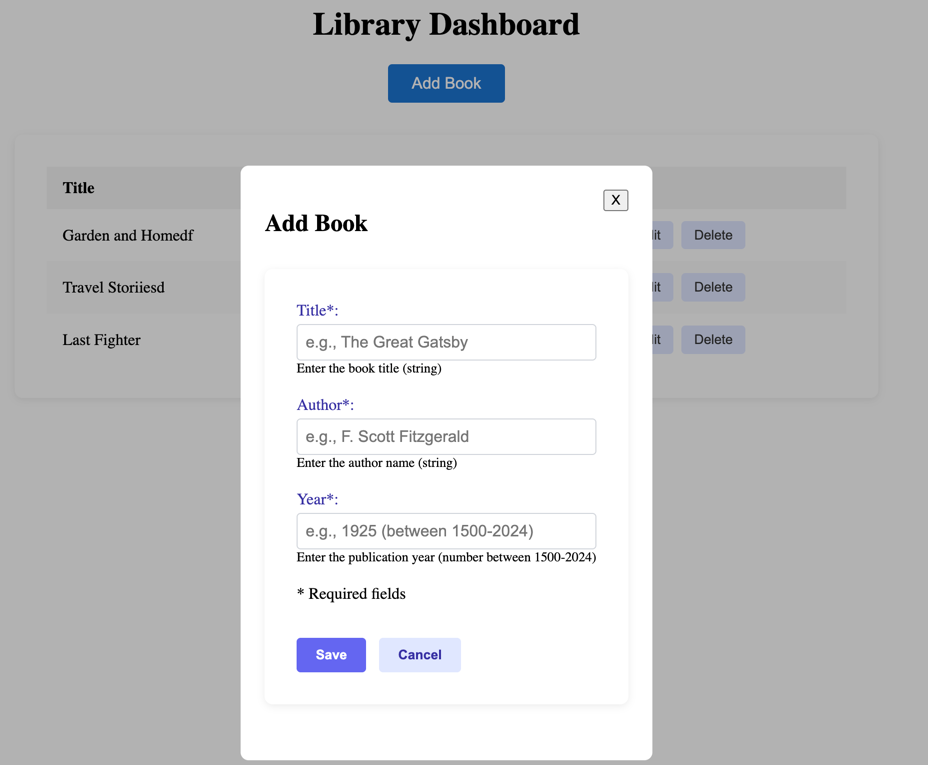
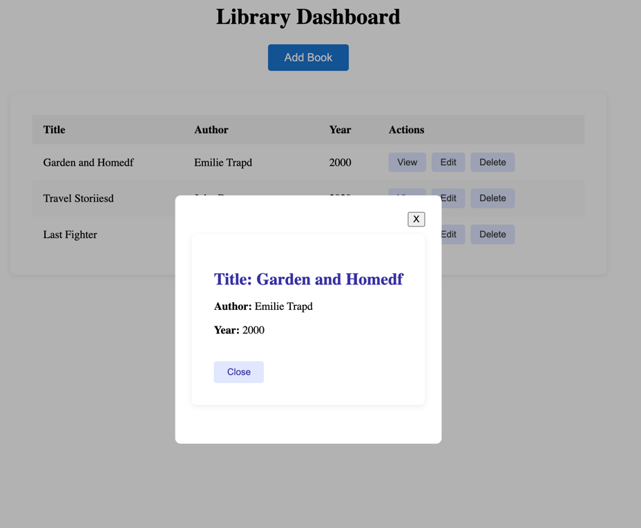
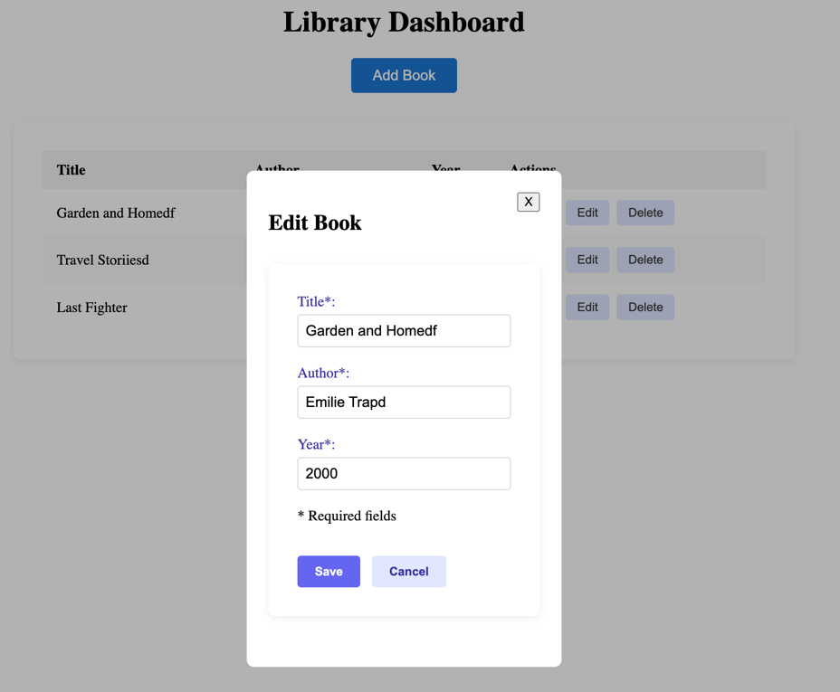
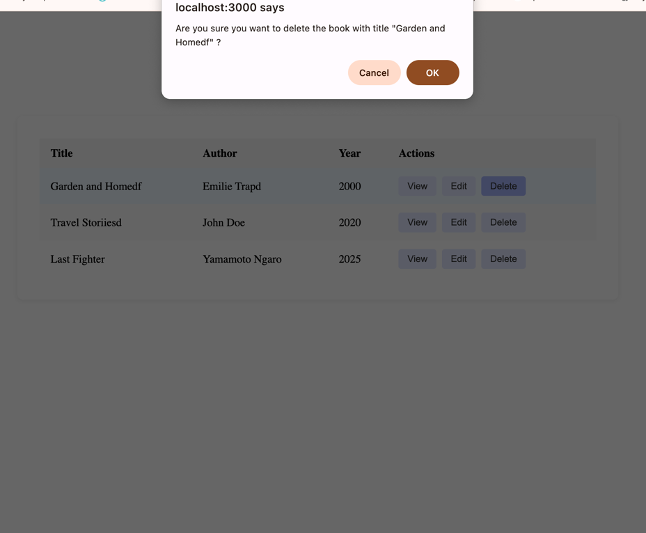

# byfood-fe

A simple book management app built with React, TypeScript, and Context API.

## Features

- List all books with title, author, and year
- Add new books (with validation)
- Edit existing books
- View book details in a modal
- Delete books (with confirmation and book title)
- User-friendly error handling
- Responsive UI with modular CSS

## Project Structure

- **components/**: UI components and styles
- **context/**: React Context for global state
- **pages/**: Next.js pages (entry points)
- **types/**: TypeScript type definitions
- **styles/**: Global CSS

## Dependencies

- React
- Next.js
- TypeScript
- CSS Modules

Install all dependencies with:

```sh
npm install
```

## Folder Overview

- **components/**: Reusable UI components and styles
- **context/**: Global state management using React Context
- **pages/**: Entry points powered by Next.js
- **types/**: TypeScript type definitions
- **styles/**: Global styles and resets

## Setup & Run

### Using WebStorm (Recommended)

1. Clone the repository

   ```sh
   git clone https://github.com/burhangltekin/byfood-fe.git
   ```

2. Open in WebStorm
    - File → Open... → Select the cloned folder

Note: In order for application to run, you must have Node.js and npm installed.

3. Install dependencies
    - Open terminal (⌥F12 or View → Tool Windows → Terminal)

      ```sh
      npm install
      ```

4. Run the application
    - Use the Run/Debug configuration:
        - Top-right dropdown → Select `npm run dev` → ▶️ Green play button
    - Or manually:

      ```sh
      npm run dev
      ```

Note: As this frontend application is designed to work with the its backend part so for testing/running/debugging this app backend should be already up and running simultaneously.

   - Backend repository: [github.com/burhangltekin/byfood]

5. Debugging
    - Set breakpoints in .tsx files
    - Start in Debug mode (green bug icon)
    - Use the Debug tool window to inspect app behavior

6. Open in browser
    - [http://localhost:3000](http://localhost:3000)

### Using CLI

```sh
git clone https://github.com/burhangltekin/byfood-fe.git
cd byfood-fe
npm install
npm run dev
```

Visit: [http://localhost:3000](http://localhost:3000)

---

## Book Details Schema

Each book includes the following fields:

| Field  | Type    | Description                |
|--------|---------|----------------------------|
| id     | number  | Auto-generated identifier  |
| title  | string  | Required                   |
| author | string  | Required                   |
| year   | number  | Required                   |

---

## Notes

- All forms feature client-side validation.
- Deleting a book shows a confirmation prompt with the book title.
- Application state is managed using the React Context API.
- UI is styled using CSS Modules for maintainable and scoped styles.

Screenshots






